# GTN implementation

This is a partial implementation of [Generative Teaching Networks](https://arxiv.org/abs/1912.07768) by Such et al. (Uber AI Labs, 2019)

An MNIST Teacher/Learner was implemented using [PyTorch](https://pytorch.org/) and [higher](https://github.com/facebookresearch/higher)
with the aim to confirm and further investigate curriculum generation properties of GTN.

We were able to (approximately) reproduce the curriculum generation results; see below for more details. We did not attempt to reproduce the architecture search results, although given a working implementation of the base algorithm, this should now be a straightforward endeavour.

## GTN overview
GTN is composed of two neural networks (both use CNN + linear layers):
 * teacher - takes random vectors as input and produces MNIST-like images
 * learner - learns to classify images produced by the teacher
 
A nice property of GTN is that a learner taught only on the teacher-generated images will perform well on real data and the architecture's performance on GTN-generated data should be indicative of its performance on real data (a much larger dataset).

GTN is learned through a meta-learning setup, using two loops:
 * inner-loop - "normal" learning - the learner learns to classify images produced by the teacher, the teacher is not updated
 * outter-loop - meta-learning - the learned learner is evaluated on real data (MNIST dataset in our case), 
                 final loss is computed and backpropagated through unrolled inner-loop steps 
                 back to the teacher, which is updated this time (by meta gradients)  

An overview of the GTN setup as presented in [the original paper - Figure 1(a)](https://arxiv.org/abs/1912.07768):\
 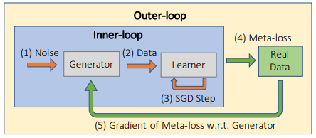

## Results
We setup the teacher and learner and set out to investigate (1) what type of artificial data the teacher will generate for the learner and (2) if we can replicate the emergence of a accuracy-increasing curriculum from the original paper.

Three experiment configuration were run:
 * *Experiment A*: batch_size: 32, inner_loop_steps: 20 (640 teacher-generated MNIST-images in total)
 * *Experiment B*: batch_size: 32, inner_loop_steps: 10 (320)
 * *Experiment C*: batch_size: 16, inner_loop_steps: 10 (160)
 
The input tensor of the teacher network (`teacher_input`) that defines the learned curriculum has the following dimensions: [inner_loop_steps, batch_size, 64]

For each experiment configuration three variants of GTN were tested, varying in input data of the teacher network (`teacher_input`):
 * "learned" - input tensor was initialized randomly and learned as a parameter of the teacher network
 * "random_fixed" - input tensor was initialized randomly and fixed during the whole experiment run
 * "random" - input tensor was re-initialized with random data for each inner-loop iteration

resulting in a total of 9 experiments.

### Experiment A: batch_size: 32, inner_loop_steps: 20
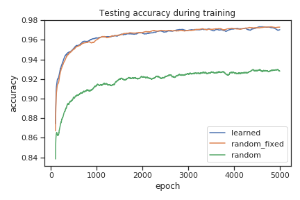

The figure above shows the testing accuracy for the three variants of GTN. Notice the practically identical performance of "learned" and "random_fixed" variants. Moreover, when the network was prevented from using a curriculum ("random"), the performance of the learned network suffered.

In order to confirm that the teacher indeed learned a beneficial curriculum in the "learned" and "random_fixed" variants,
teacher input tensors were shuffled in the meta-testing phase (by the first dimension - 
order in which inputs were presented to learner during inner loop was randomized).

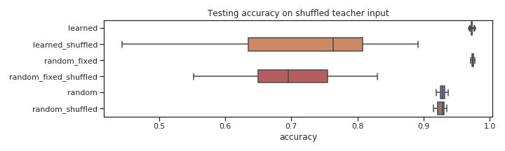

The chart above shows that both “learned” and “random_fixed” variants suffered a big accuracy drop due to the shuffling, 
while “random” was not affected. An explanation for this behavior is that both “learned” and “random_fixed” variants developed 
a curriculum (ordering of data samples presented to learner) that improves the accuracy. “learned” was designed with 
this property in mind, but “random_fixed” was a surprise - a curriculum is encoded in teacher weights.

#### Generated dataset visualization
The pictures below visualize the dataset generated by the teacher. Each row represents a batch that the learner takes as input during inner_loop steps, 
starting from the top row. The number of rows is `inner_loop_steps` and number of columns is `batch_size`.
 

Images produced by teacher - variant "learned"\
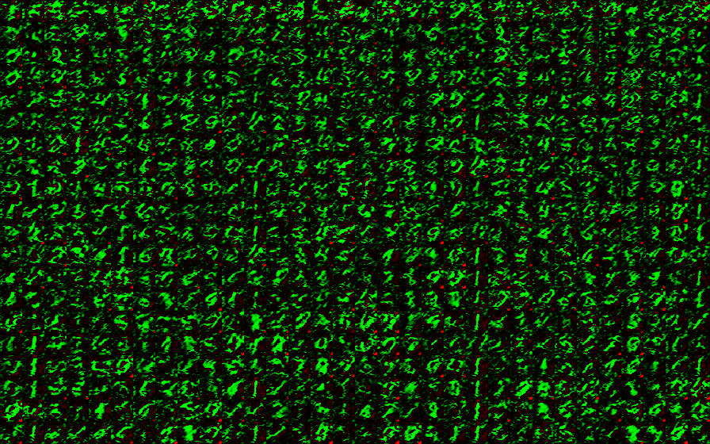

Images produced by teacher - variant "random_fixed"\
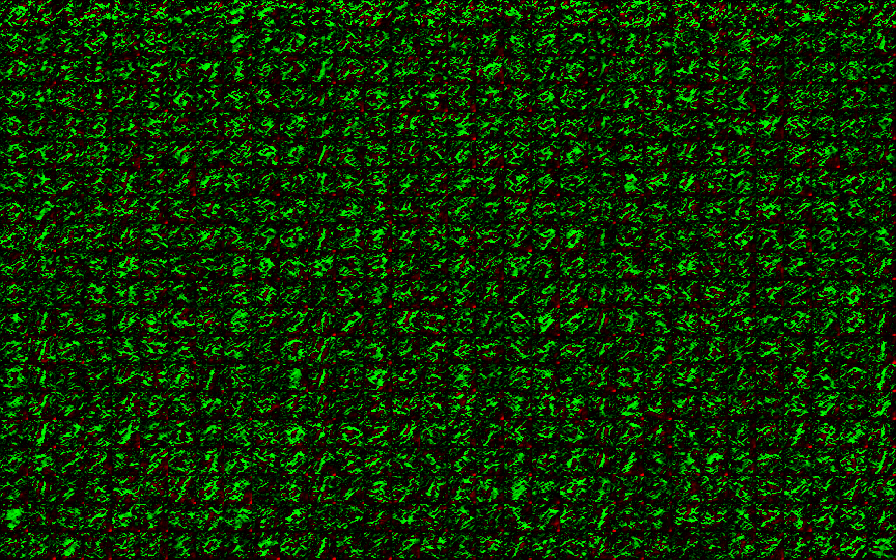

Images produced by teacher - variant "random"\
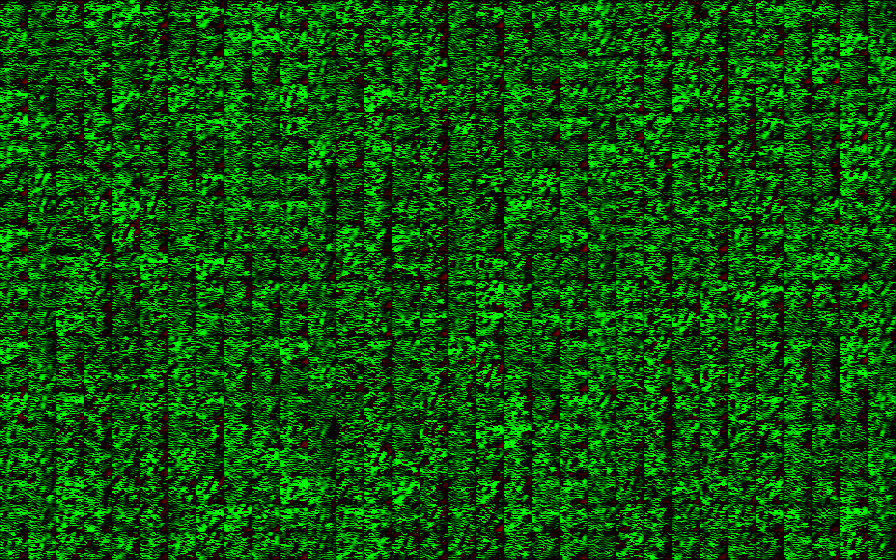

### Experiment B: batch_size: 32, inner_loop_steps: 10
The charts and illustrations below are analogous to those of experiment A. The inner loop training was reduced by 10 steps, which resulted in a 1% drop of testing accuracy.

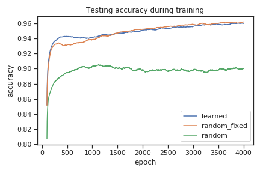

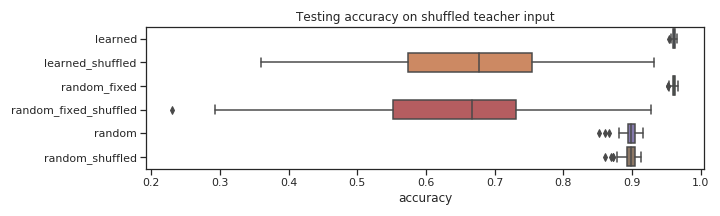

Images produced by teacher - variant "learned"\
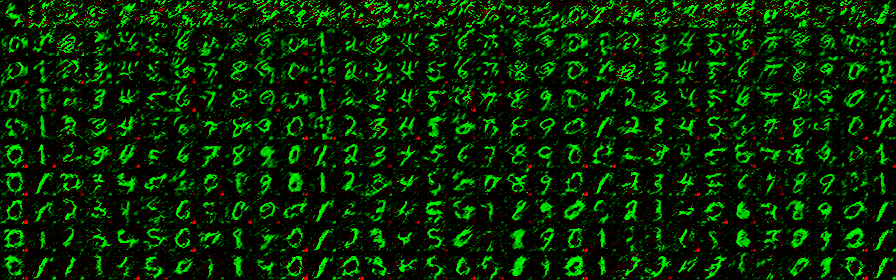

Images produced by teacher - variant "random_fixed"\
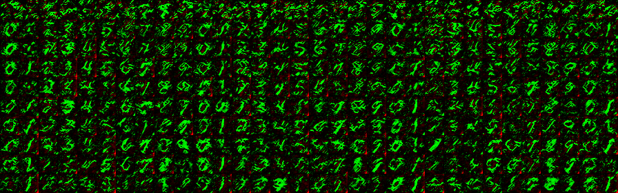

Images produced by teacher - variant "random"\
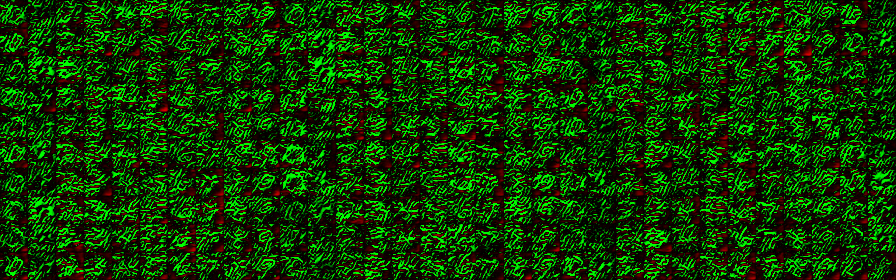

### Experiment C: batch_size: 16, inner_loop_steps: 10
The charts and illustrations below are analogous to those of experiments A and B. Further drop in accuracy can be attributed to decreased batch size. Notice that the learner network was trained using only 1/4 of data from experiment A, yet still it suffers only a 2% drop in accuracy in the "learned" and "random_fixed" variants (compare to the 6% drop in the "random" variant).

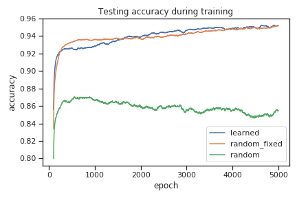

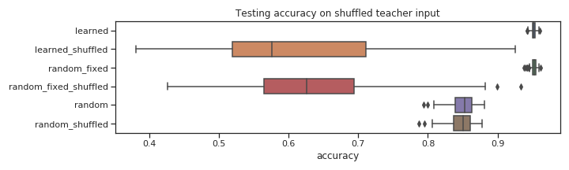

Images produced by teacher - variant "learned"\
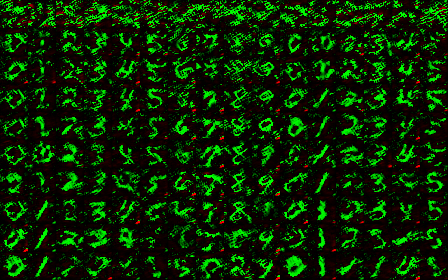

Images produced by teacher - variant "random_fixed"\
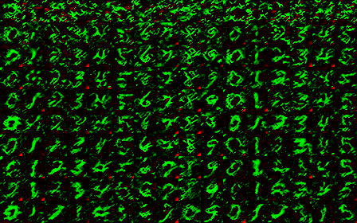

Images produced by teacher - variant "random"\
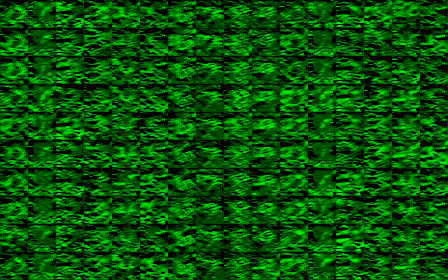

### Discussion

* We were able to almost match the GTN results on MNIST dataset from the original paper, compare:

| GTN results [paper - Figure 1(c)](https://arxiv.org/abs/1912.07768) | Experiment A results |
:------------:|:-----------:
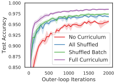 | 

We attribute the lower accuracy of our result to the smaller batch_size (32 in our experiment vs 128 in GTN paper) and possibly to 
a lack of some features and fine tuning - like weight normalization and gradient checkpointing.

* It was shown that the **teacher created a curriculum**
* Note the nice [gradual images](#experiment_b_learned) generated by the "learned" teacher in Experiment B

## How to Install

Requires python version >= 3.7

1. `pip install -r requirements.txt`
2. Install [higher library](https://github.com/facebookresearch/higher)
3. (Optional - results visualization) Run local sacred/omniboard by 
    1. Install [Docker](https://www.docker.com/) and [Docker Compose](https://docs.docker.com/compose/install/)
    2. `cd sacred`
    3. `docker-compose up -d`
    4. Open `localhost:9000` in browser (note port 9000 can be changed in `sacred/docker-compose.yml`)

## How to Run

Run a single experiment using the [`experiments/mnist_experiment.py`](./experiments/mnist_experiment.py) file. \
Run multiple experiments using [`experiments/run_tasks.py`](./experiments/run_tasks.py) - current setup will replicate the presented results. \
View results using omniboard or [`experiments/ntb_result_analyzer.ipynb`](./experiments/ntb_result_analyzer.ipynb) notebook - running all cells will generate 
images and charts presented in the results (sacred run ids have to be changed)

### Notes: 
 * Weight Normalization and gradient checkpointing were not implemented as not being necessary - 
learning showed almost no variance and model fit into 11GB of GPU memory
 * BatchNorm and Kaiming initialization were necessary for stable learning
